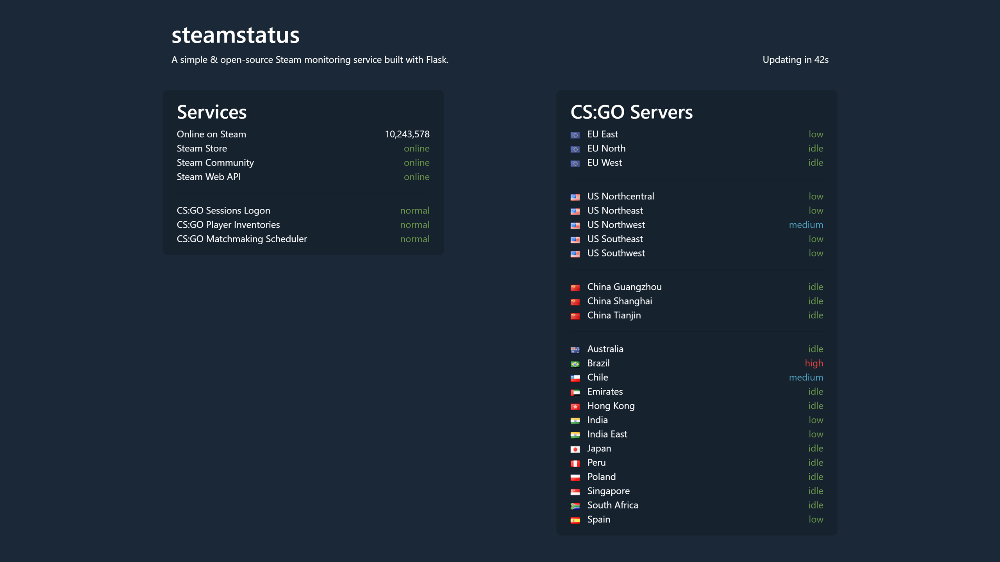

# steamstatus

A Steam monitoring service built with Flask



## Requirements

- Python 3.4+
- A modern browser supporting [async functions](https://caniuse.com/#feat=async-functions)

## Installation: Linux & macOS

1. Clone the repository

    ```Shell
    git clone https://github.com/akelsch/steamstatus.git
    ```

2. Create a virtual environment and install all required packages

    ```Shell
    cd steamstatus
    python -m venv venv
    source venv/bin/activate
    pip install -r requirements.txt
    ```

    See [`requirements.txt`](requirements.txt) for a complete list of required packages.

3. Insert your **[Steam API key](https://steamcommunity.com/dev/apikey)** in [`config.py`](src/config.py)

    ```Python
    API_KEY = "" # insert your key here, e.g. 204BE844F017F63E40E2F3D820EB8E9E
    UPDATE_FREQUENCY = 60
    ```

4. Set Flask environment variables

    ```Shell
    export FLASK_APP=app.py
    export FLASK_ENV=development # optional
    ```

5. Run the app

    ```Shell
    cd src
    flask run
    ```

## Installation: Windows

PowerShell commands differ quite a bit from Bash so here are some equivalent commands:

```PowerShell
# source venv/bin/activate
.\venv\Scripts\Activate.ps1

# export FLASK_APP=app.py
$env:FLASK_APP = "app.py"

# export FLASK_ENV=development
$env:FLASK_ENV = "development"
```

Please note that running scripts in PowerShell requires changing your execution policy to `Unrestricted` (see [Set-ExecutionPolicy](https://docs.microsoft.com/en-us/powershell/module/microsoft.powershell.security/set-executionpolicy?view=powershell-6)).

## Acknowledgments

Flag icons by [Mark James](http://www.famfamfam.com/lab/icons/flags/)
