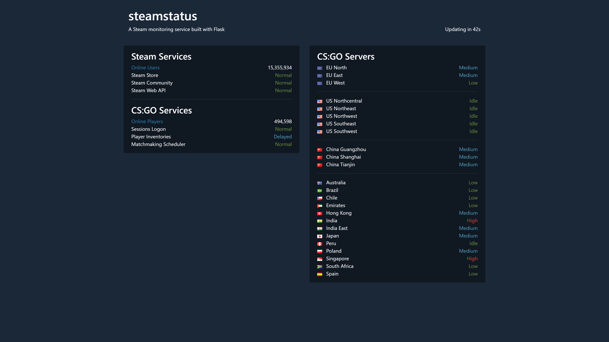

# steamstatus

A Steam monitoring service built with Flask



## Requirements

- Python 3.10 or Docker
- A modern browser supporting [async functions](https://caniuse.com/#feat=async-functions)

## Getting Started

1. Install

    ```Shell
    git clone https://github.com/akelsch/steamstatus.git && cd steamstatus
    python -m venv venv
    source venv/bin/activate
    pip install -r requirements.txt
    ```

    See [`requirements.txt`](requirements.txt) for a complete list of required Python packages.

2. Configure

    ```Shell
    export FLASK_APP=steamstatus
    export FLASK_ENV=development
    export API_KEY=xxx # insert your key here, e.g. 204BE844F017F63E40E2F3D820EB8E9E
    ```

    You can get your own Steam Web API Key [here](https://steamcommunity.com/dev/apikey).

3. Run

    ```Shell
    flask init-db
    flask run
    ```

    Note that initializing the database is required once only.

### Using Windows

Activating Python virtual environments in PowerShell requires changing your [execution policy](https://docs.microsoft.com/en-us/powershell/module/microsoft.powershell.security/set-executionpolicy) first:

```PowerShell
Set-ExecutionPolicy Unrestricted
.\venv\Scripts\Activate.ps1
```

Feel free to use [`env.ps1`](env.ps1) to set Flask environment variables. You still will have to provide `API_KEY` though.

### Using Docker

Similar to running the application natively, you will have to provide `API_KEY` by passing it to Docker:

```Shell
docker build . -t steamstatus
docker run -p 5000:5000 -e API_KEY=xxx steamstatus
```

Alternatively you can modify [`Dockerfile`](Dockerfile) to hardcode your key.

## Acknowledgments

Flag icons by [Mark James](http://www.famfamfam.com/lab/icons/flags/)
